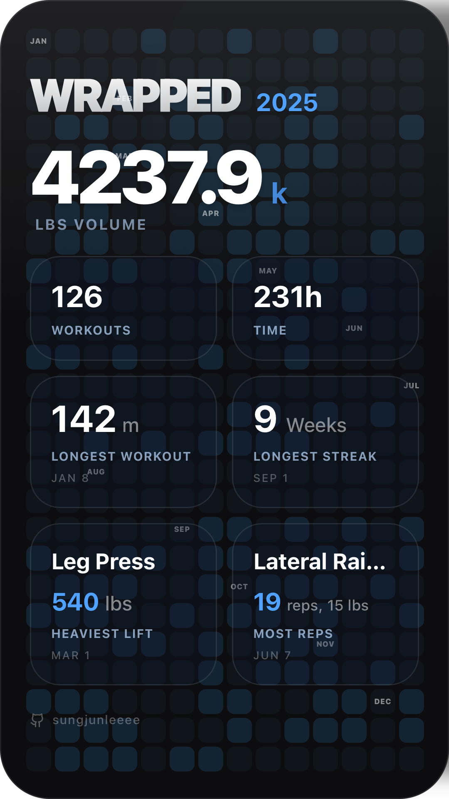

# Strong Wrapped

Visualize your year in gains with a Spotify Wrapped-style summary for your Strong app workout data.

**Try it out here! [https://sungjunleeee.github.io/strong-wrapped](https://sungjunleeee.github.io/strong-wrapped)**




## 🚀 Features

- **Visual Story:** Experience your workout year through animated slides (Intro, Stats, Top Exercises, Consistency, Summary).
- **Shareable Summary:** Generate and share a sleek image card of your annual stats directly from the app.
- **Privacy First:** All CSV parsing and data processing happens **locally** in your browser. No data is sent to any server.
- **Strong App Compatible:** Designed to work specifically with the CSV export from the Strong workout tracker.
- **Customizable:** Choose your preferred units (kg/lbs) and select the specific year you want to view.

## 📝 How to Use

1. **Export Your Data:**
   - Open the **Strong** app on your device.
   - Go to **Profile** > **Settings** > **Export Data**.
   - Choose **Export as CSV** and save the file to your device.

2. **Upload & Visualize:**
   - Visit [Strong Wrapped](https://sungjunleeee.github.io/strong-wrapped).
   - Click to upload or drag & drop your exported CSV file.
   - Select the year you want to visualize.
   - Enjoy your personalized workout summary!

## 🛠️ Tech Stack

- **Framework:** [React](https://react.dev/) + [Vite](https://vitejs.dev/)
- **Language:** [TypeScript](https://www.typescriptlang.org/)
- **Styling:** [Tailwind CSS](https://tailwindcss.com/) + [clsx](https://github.com/lukeed/clsx) / [tailwind-merge](https://github.com/dcastil/tailwind-merge)
- **Animations:** [Framer Motion](https://www.framer.com/motion/)
- **Charts:** [Recharts](https://recharts.org/)
- **Utilities:** `papaparse` (CSV parsing), `date-fns` (Date manipulation), `lucide-react` (Icons)
- **Export:** `html-to-image` (Shareable summaries)

## 🏃‍♂️ How to Run Locally

1. **Clone the repository**
   ```bash
   git clone https://github.com/sungjunleeee/strong-wrapped.git
   cd strong-wrapped
   ```

2. **Install dependencies**
   ```bash
   npm install
   ```

3. **Start the development server**
   ```bash
   npm run dev
   ```

4. **Build for production**
   ```bash
   npm run build
   ```

## 🔒 Privacy & Security

This application runs client-side only. When you upload your Strong CSV export, the file is parsed directly in your browser's memory. No workout data is ever transmitted to a backend or third-party service.

## ⚠️ Disclaimer

This is a personal project and is **not** affiliated with, endorsed by, or connected to [Strong](https://www.strong.app/). "Strong" is a registered trademark of Strong Fitness Pte Ltd.

---

Made with ❤️ by [Sungjun](https://github.com/sungjunleeee) as an experiment with **Google Antigravity**.
